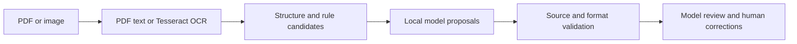

# Invoice Lab

A local document extraction and review workbench for invoices and transport
rate confirmations. Read PDFs/images, extract editable fields, inspect their
source evidence, and optionally use a local language model for extraction and
explanations.

## Features

- Per-page PDF text routing with Tesseract fallback and a Force OCR option.
- Saved words, lines, coordinates, OCR confidence and provisional table structure.
- Rule-based invoice fields/items and page-specific rate-confirmation records.
- Local Ollama extraction with readable evidence, citations and generated explanations.
- Exact source checks and targeted rate-confirmation role validation; rejected
  proposals remain inspectable.
- Separate model review, clearly labeled as self-assessment.
- Editable field/value rows, batch corrections, source previews and revision checks.
- Searchable saved analyses, progress/error states and original/current JSON exports.



## Quick start

Prerequisites: Python 3.10+, Tesseract with English language data for OCR, and
Ollama with an installed model for optional AI. The existing development
installation uses Python 3.13 and `qwen2.5:1.5b`.

From the repository root:

```bash
python3 -m venv .venv
source .venv/bin/activate
python -m pip install -r requirements.txt
```

Install Tesseract through your platform's package manager; for supported macOS
Homebrew installations:

```bash
brew install tesseract
tesseract --version
```

For local AI, install Ollama from its official distribution, then:

```bash
ollama pull qwen2.5:1.5b
ollama serve
```

If Ollama is already running, do not start a second service. In another terminal:

```bash
source .venv/bin/activate
python invoice_ui.py --port 8766
```

Open <http://127.0.0.1:8766/>. Upload `demo_searchable.pdf` or
`demo_scanned.pdf`; both are fictional generated examples. Enable automatic AI
analysis if the local model is connected. The code defaults to port 8765 when
`--port` is omitted. See [complete setup instructions](docs/SETUP.md) for
Linux/Windows notes, executable paths, CLI usage and hardware troubleshooting.

## Workspace

| Section | Purpose |
|---|---|
| New analysis | Upload a PDF/image and choose OCR/AI options |
| Saved results | Search, filter and reopen analyses |
| Fields | Review and edit extracted values beside their labels |
| Line items | Inspect rule/table-extracted invoice rows |
| How extraction works | Read field roles and the actual passages supplied to AI |
| AI explanation & results | Inspect generated interpretations, proposals, source checks and review |
| OCR transcript | Read the source text before interpretation |
| Source preview / Export | Check the original evidence or download JSON reports |

Click a value or pencil to edit, then save corrections together. Saved human
reviews are protected from model overwrites. Model inference runs in the
background and saves per-page progress. Stop the web server with **Ctrl+C**;
saved analyses remain available on restart.

## Documentation

- [Setup and operation](docs/SETUP.md)
- [User guide](docs/USER_GUIDE.md)
- [Architecture and code map](docs/ARCHITECTURE.md)
- [Testing and evaluation](docs/TESTING.md)
- [Troubleshooting](docs/TROUBLESHOOTING.md)
- [Privacy, scope and limitations](docs/PRIVACY_AND_LIMITATIONS.md)
- [Contributing](CONTRIBUTING.md)

## Tests and reproducible demo

```bash
python make_demo.py
python -m unittest -v test_invoice_lab.py test_invoice_ui.py test_pipeline.py test_review_workspace.py
python invoice_lab.py extract demo_scanned.pdf --out output/scanned
python invoice_lab.py evaluate output/scanned/result.json ground_truth.json
```

The suite has 40 tests. Two optional local OCR regressions require private
fixtures excluded from this repository and skip when prerequisites are absent.
The shared demo provides an independent reproducible OCR smoke check.
Automated tests mock model calls; live inference requires Ollama separately.

## Data and reliability

Browser uploads and evidence are stored under `ui-runs/<id>/`. The initial
report remains separate from the latest reviewed report, with source evidence
and correction history retained. Uploaded documents, private fixtures, saved
runs, logs and environments are excluded from version control. Only fictional
demo inputs are included. Do not commit customer documents or generated reports.

The application sends its model requests to local Ollama. It has no cloud
inference integration. Local processing does not provide encryption at rest,
authentication or a compliance guarantee.

OCR confidence, application evidence heuristics and model review scores are
separate. None is a measured accuracy probability. Source-backed values can
still be assigned incorrectly, and model explanations can be weak or inaccurate.
The small local model is not a guarantee of expert-level extraction. Corrections
do not retrain it. This is a functioning local workbench, not a hardened
multi-user production service; see the limitations document before deployment.

## License

No project license has been selected. Third-party packages, Tesseract and model
weights retain their own licensing terms and are not bundled here.
