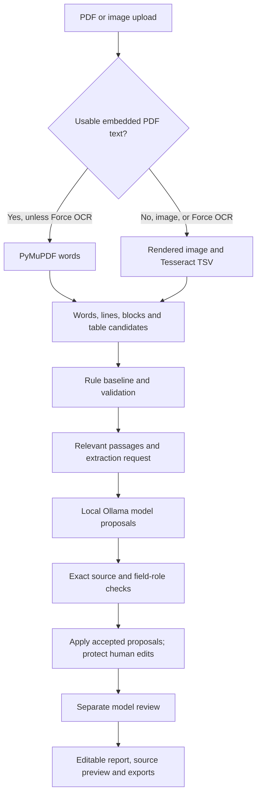

# Architecture and extraction design

Invoice Lab combines deterministic document processing with optional local
model proposals and human review. Tesseract reads characters; it does not map
business fields. The application and model perform that mapping.

## Code map

| File | Responsibility |
|---|---|
| `invoice_core/document.py` | PDF/image reading, routing, Tesseract, coordinates and OCR recovery |
| `invoice_core/structure.py` | Source blocks, reading order and aligned table candidates |
| `invoice_core/extraction.py` | Rule candidates, invoice fields/items and rate confirmations |
| `invoice_core/validation.py` | Field formats and invoice totals checks |
| `invoice_core/confidence.py` | Evidence components and review priority |
| `invoice_core/llm.py` | Shared request builder, Ollama calls, quote checks, proposals and review |
| `invoice_core/storage.py` | Temporary-file writes and atomic replacement |
| `invoice_core/legacy_llm.py` | Prior model adapters retained for compatibility |
| `invoice_lab.py` | Pipeline coordinator, annotated previews, evaluation and CLI |
| `invoice_ui.py` | Local HTTP API, saved reports, background model jobs and correction transactions |
| `ui/app.js` | Routed UI, editing, source inspection and model-job polling |
| `ui/index.html`, `ui/style.css` | Browser layout, navigation and responsive presentation |

## Reading and structure

PDF routing is per page. Embedded text is assessed using character count,
alphanumeric ratio and invalid-character ratio. It is a routing heuristic,
not an accuracy estimate. Sparse or malformed text falls back to OCR. Force
OCR renders all PDF pages at 300 DPI. Images are converted to RGB and small
images are upscaled.

Tesseract receives PNG bytes over stdin and returns English TSV output over
stdout. PSM 3 handles automatic page segmentation. Additional PSM 6 passes
recover certain header or table content. Scanned PDF table recovery retains
the original words and excludes overlapping additions in the table body.

Word records retain IDs, bounding boxes and engine confidence. Native PDF
coordinates are PDF points and have no OCR confidence. OCR coordinates are
rendered-image pixels. Source IDs connect extracted values to words and pages.
Lines and source blocks are grouped before model inference; detected tables
remain provisional layout candidates.

## Candidate extraction

Rules identify labels, adjacent values, party sections and expected formats.
Ambiguous candidates remain available for inspection. Rate-confirmation forms
are identified from their characteristic labels, and records remain page
specific. Other inputs are invoice candidates, not universally classified
document types. Invoice line items currently use rules/table processing,
not the Ollama field-extraction stage.

## What reaches the model

`build_requests()` is shared by the request preview and inference path. It
creates a request per relevant page containing readable source passages,
field instructions, unverified baseline candidates and a JSON response schema.
Rate packets select relevant labels, invoice-section headings and candidate
value lines. Invoice requests use the page's source lines.

The model uses short aliases such as `L1` and `L2`; a source map resolves them
back to original line IDs. It is asked for each field's value, citation and
reason, plus a document summary and extraction explanation. Full word boxes
remain in application evidence rather than being duplicated into the prompt.
This is rule-based document retrieval, not embedding/vector-database retrieval.

The backend calls Ollama's `/api/generate` endpoint at localhost port 11434.
Temperature is zero, output is constrained by a schema, and context capacity
is selected from bounded sizes. Oversized prompts and responses that reach
their output limit produce explicit failures. Temperature zero improves
repeatability but does not guarantee identical or correct output across models
and runtime versions.

## Validation and promotion

The backend resolves the cited line and searches for an unambiguous exact
value span. Case and supported money formatting can be normalized without
inventing digits. Unknown citations, unsupported values and ambiguous spans
are rejected. Legacy word-ID selections remain supported.

Rate proposals also undergo role checks: carrier label, order label, payment
label, and invoice numbers in the invoice-reference section. A reference list
with rejected entries does not replace the existing list. Valid source quotes
are necessary evidence, not proof of complete business correctness.

Human-reviewed values are not overwritten by model proposals. The immutable
rule baseline remains available. Cross-page conflicts can be marked for
inspection rather than silently resolved.

## Scores and arithmetic

Evidence components are OCR recognition (35%), label/section (35%), format
(20%) and applicable consistency (10%). Missing components are excluded and
weights renormalized. These weights are heuristics, not calibrated probabilities.
The model's separate review score is a self-assessed opinion, not an independent
evaluation of its extraction.

Invoice totals use `Decimal` arithmetic and compare taxable amount plus
extracted taxes with the printed total, with supported round-off handling.
Item rows check quantity multiplied by rate against amount. Missing inputs
produce `not_checked`; discrepancies remain available for review. GSTIN checks
validate textual format, not registry status.

## Jobs, corrections and storage

The UI starts a background model job and polls persisted progress. Pages are
processed sequentially within each job. Inference runs outside the report-write
lock. Completed pages are saved; failures do not erase already completed work.
An interrupted job is identified after restart but does not automatically resume.

Batch edits are validated on a copy before writing. SHA-256 report revisions
reject stale browser saves. Writes use temporary files and replacement.
Reviews based on changed report revisions are discarded. These safeguards are
for the current single-process application, not distributed transaction control.

| Artifact under `ui-runs/<id>/` | Contents |
|---|---|
| Uploaded source | Original document |
| `output/extracted.json` | Page metadata, words and lines |
| `output/structured.json` | Structure saved before model inference |
| `output/result.json` | Initial report |
| `output/reviewed_result.json` | Latest model results and human corrections |
| `output/model_job.json` | Progress, status and failure details |
| `output/page-N.png` | Annotated page previews |
| `reviewed_truth.json`, when supplied | Expected values for evaluation |

Corrections retain original-value information, evidence and append-only review
history. They do not train the model. Editing clears outdated model reviews.
